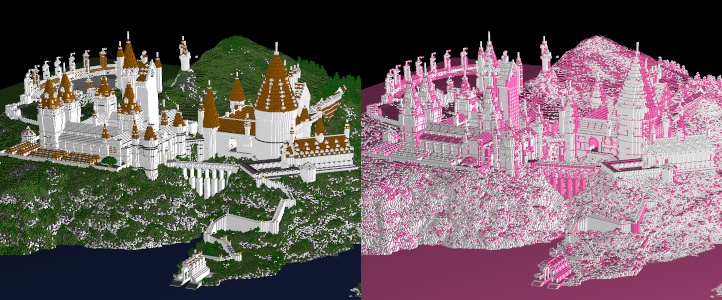

# Skimpy

## Summary
A PyTorch-like tensor library which maintains end-to-end
run-length compression to reduce operator costs and memory
pressure. With highly compressible tensors 
like Minecraft voxel grids we achieve near-GPU like performance
for convolutions.

\
*Highlighting compressible runs within a minecraft voxel grid*

## To install as a Python extension
```bash
> pip install .
```

## To build and run tests
```bash
> python -m venv .venv/
> source .venv/Scripts/activate
> pip install -r requirements.txt
> python tools/build.py
```

## System requirements
1. Python >=3.6 
2. C++ compiler toolchain
3. CMake
4. CUDA toolkit (optional)
